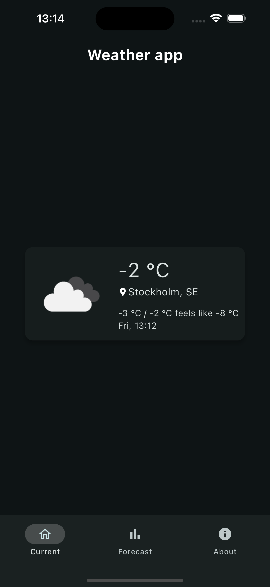
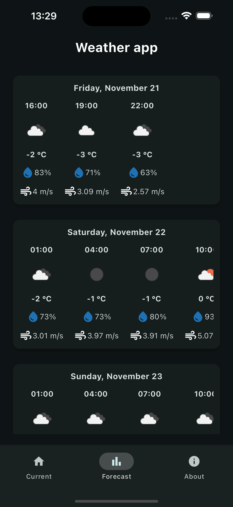

# Weather Application

## Description

This project was developed as part of a course in university. It consists of two pages dedicated to the weather in the location of the user: one of which is the current and the other one is the weather for the upcoming week.

## Installation

1. Install Flutter SDK: [Installation Guide](https://flutter.dev/docs/get-started/install)
2. Clone the repository:
   ```bash
   git clone git@github.com:jaensson/WeatherApplication.git
   ```
3. Navigate to the project folder and install dependencies:
   ```bash
   cd WeatherApplication
   flutter pub get
   ```
4. Run the app on your desired platform:
   ```bash
   flutter run
   ```

## Screenshots

<div style="display:flex; justify-content:space-between;">
    
    
</div>
